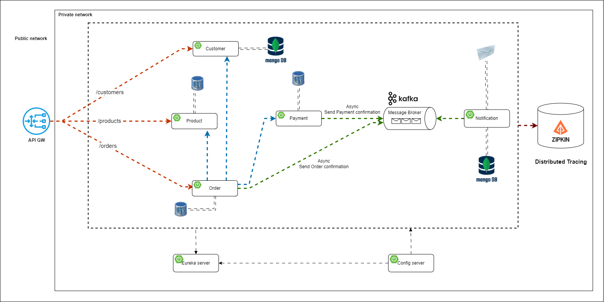

# Проект: e-commerce microservices

Проект представляет собой набор микросервисов, разработанных с использованием современных технологий и фреймворков. Каждый микросервис выполняет определенную функцию и взаимодействует с другими сервисами через REST API, Kafka, Eureka и другие инструменты.

## Архитектура проекта

Ниже представлена диаграмма, иллюстрирующая взаимодействие между микросервисами:

## Общий стек технологий

### Основные технологии:
- **Java 17**: Основной язык программирования.
- **Spring Boot 3.x**: Фреймворк для создания микросервисов.
- **Spring Cloud**: Для реализации облачных паттернов, таких как конфигурация, обнаружение сервисов и балансировка нагрузки.
- **Maven**: Для управления зависимостями и сборки проекта.

### Базы данных:
- **PostgreSQL**: Реляционная база данных.
- **MongoDB**: NoSQL база данных.

### Брокер сообщений:
- **Apache Kafka**: Для асинхронного обмена сообщениями между микросервисами.

### Обнаружение сервисов:
- **Netflix Eureka**: Для регистрации и обнаружения микросервисов.

### API Gateway:
- **Spring Cloud Gateway**: Для маршрутизации запросов к микросервисам.

### Конфигурация:
- **Spring Cloud Config**: Для централизованного управления конфигурацией.

### Документация API:
- **SpringDoc OpenAPI**: Для автоматической генерации документации API.

### Логирование и мониторинг:
- **Micrometer Tracing**: Для трассировки запросов.
- **Zipkin**: Для визуализации трассировок.
- **Actuator**: Для мониторинга состояния микросервисов.

### Безопасность:
- **Keycloak**: Для аутентификации и авторизации.

### Дополнительные библиотеки:
- **Lombok**: Для сокращения boilerplate кода.
- **Dotenv Java**: Для работы с переменными окружения.
- **Swagger Annotations**: Для аннотирования API.

### Тестирование:
- **JUnit**: Для модульного тестирования.
- **Mockito**: Для мокирования зависимостей в тестах.
- **Spring Kafka Test**: Для тестирования Kafka.

### Инфраструктура:
- **Docker & Docker Compose**: Для настройки и запуска всей инфраструктуры.